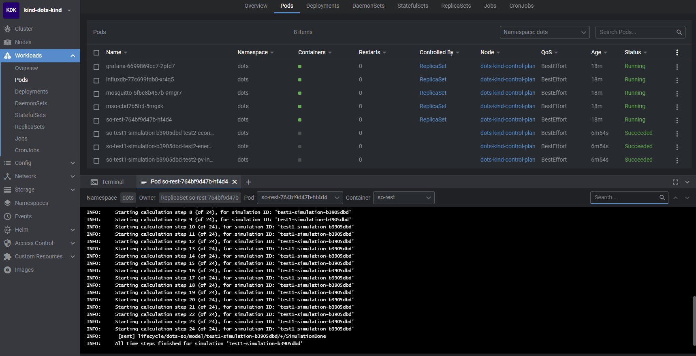

# Simulation Orchestrator for the Energy System Microservices Cloud Simulator

Build for GO-e WP3. Previous working name DOTS.  
This simulation orchestrator is controlled by api calls (FastAPI) and communicates with the Model Services
Orchestrator (MSO) via MQTT protobuf messages.

On the [MCS wiki](https://ci.tno.nl/gitlab/groups/dots/-/wikis/home) you can find a description of the framework along
with installation and usage details.

## Development

### Python environment

Create a python virtual environment (3.10) and install the dependencies:

```console
pip install pip-tools==6.10
pip-compile ./requirements.in --output-file ./requirements.txt
python -m pip install -r requirements.txt
```

### Push image

In the `ci` folder there are two scripts to push the image to ci.tno.nl or to a local kind cluster.

## Local Deploy and testing

Deployment can be done on a cloud cluster or locally for testing.
For the TUE the framework in deployed on AKS, see
[wiki](https://ci.tno.nl/gitlab/groups/dots/-/wikis/home#installation).
How to deploy and test locally is described below.

### Local deploy

Two items need to be installed first: [kind](https://kind.sigs.k8s.io/) and
[kubectl](https://kubernetes.io/docs/tasks/tools/).
Installing kind and kubectl on Windows on WSL works well, other local cluster options have not been tried.

In the `k8s` folder you can find the `deploy_dot_kind.sh` scripts which will:

- set up a cluster (on Azure or Kind) with `dots` namespace
- grep the kubernetes api token and put it in a k8s secret for the MSO
- deploy k8s env vars and secrets containing mosquitto, influxdb and grafana passwords, and ci.tno.nl token  
  (the default password values in `env-secret-config_template.yaml` should be updated for Azure)
- deploy grafana, influxdb, mosquitto, MSO and SO

For the MSO and SO the 'imagePullPolicy' is set to 'Always'.

After deployment the simulator should be ready for use, see
[wiki](https://ci.tno.nl/gitlab/groups/dots/-/wikis/home#usage-run-a-simulation).

### Local testing

There are some dummy calculation services which can be used to test the framework.
On `<SO AKS IP>:8001/docs` (<SO AKS IP> is the Simulation Orchestrator Azure IP address), or for local kind cluster
`localhost:8011/docs`, do a POST request with `test_json.json` as body.  
This should run a simulation without errors, this can be checked in [Lens](https://github.com/MuhammedKalkan/OpenLens),
make sure to also install this [extension](https://github.com/alebcay/openlens-node-pod-menu#installing-this-extension).
An example cluster with a running simulation is displayed below:  

The first 5 pods contain the base components which should always be running. The other pods contain calculation service
models which will be cleaned up after the simulation.

## Description

Below is a description of the message structure and an overview of the repository.

### Message structure

The MQTT message `topic: body` structure is described below for lifecycle events, calculation service IO data and
logging. The body is sent in a protobuf format.  
The topic consists of several parts. Generally the structure below is used, but in some cases it might deviate.

1. type of message ('lifecycle' or 'data')
2. sender name
3. intended receiver
4. simulation id
5. sender id or ESDL object ID (where the data is originating from)
6. data object name

Some examples are given below:

#### Lifecycle message example

```
/lifecycle/model/mso/test1-simulation-b3905dbd/test2-econnection-service-1/ReadyForProcessing
```  

A `ReadyForProcessing` lifecycle message for a simulation with id `test1-simulation-b3905dbd`, from a 'calculation
service `model`' (with id`test2-econnection-service-1`), to the `MSO`.

#### Data message example

```
/data/test2_pv_installation_service/model/test1-simulation-b3905dbd/1830a516-fae5-4cc7-99bd-6e9a5d175a80/pv_installation_run_time: b'\n$1830a516-fae5-4cc7-99bd-6e9a5d175a80\x11333333\x03@'
```

A `pv_installation_run_time` data object message for a simulation with id `test1-simulation-b3905dbd`, from a
`test2_pv_installation_service` (for an ESDL object with id`1830a516-fae5-4cc7-99bd-6e9a5d175a80`), to a 'calculation
service `model`'.

## Repository Structure

The repository contains several folders with different purposes:

- **ci:** build and push the docker image (`build_and_push_image_kind.sh` is not used anymore).
- **docs:** Contains the pre- and post-generation cookiecutter hooks.
- **k8s:** Contains kubernetes deployment scripts and yaml files.
- **message_definitions:** The protobuf message definitions for IO data and lifecycle
  to and from the Simulation Orchestrator. These files will be compiled to `_pb2.py` files and will be placed in the
  `messages` folder.
- **messages:** Compiled protobuf messages.
- **rest:** FastApi app.
- **simulation_orchestrator:** Code for managing the other component on the cluster via a Mosquitto broker.
- **trials:** Trials files, can be ignored.
- **.dockerignore:** A file containing which files and directories to ignore when submitting this repo as a Docker
  build context. In other words, it prevents the entries from being sent to Docker when the Docker image is build.
- **.gitignore:** A file containing which files and directories not to add to the git repository.
- **.gitlab-ci.yml:** The steps executed by the Gitlab CI pipeline when a new commit is pushed to the git repository:
  a docker image is created when merging to main ('latest') and when pushing a git tag ('tag name').
- **Dockerfile:** The build file for the Docker image.
- **requirements.txt:** The Python dependencies necessary to run the code to create a boilerplate project.
- **test_post.json:** POST request body for a test simulation.
- 